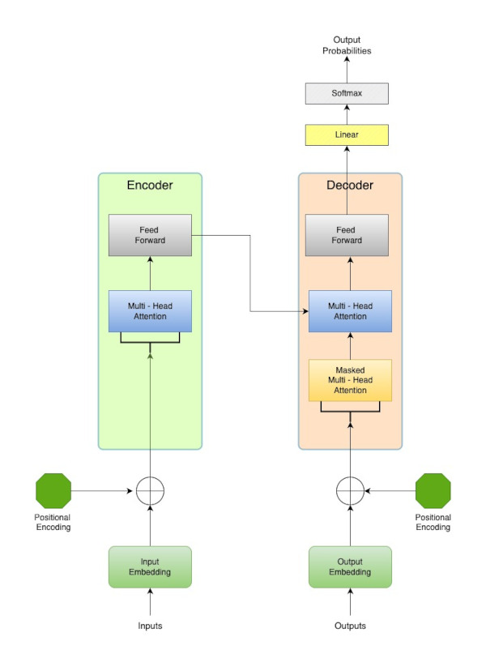
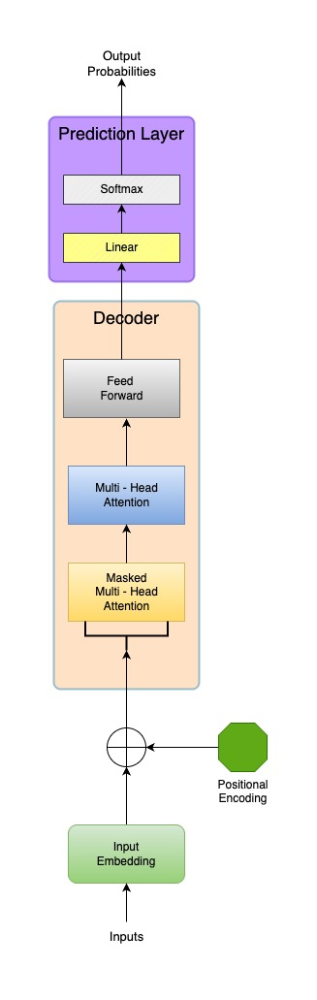

# LLM - uczenie - AI Engineering

### Architektura LLM - Transformer

W kontekście LLM, Transformer to architektura, która umożliwia modelowi przetwarzanie i rozumienie sekwencji danych, takich jak tekst, poprzez wychwytywanie złożonych zależności kontekstowych. Można powiedzieć, że jest to „silnik”, który pobiera numeryczne reprezentacje słów i przekształca je w formę, z której można generować nowy tekst lub odpowiadać na pytania.

Transformer został opisany w pracy [Attention Is All You Need](https://arxiv.org/pdf/1706.03762) oraz w artykule [Czym jest i jak działa Transformer (sieć neuronowa)](https://miroslawmamczur.pl/czym-jest-i-jak-dziala-transformer-siec-neuronowa/).

Wyróżniamy trzy główne topologie architektury Transformera. Wybór odpowiedniej zależy od rodzaju zadań, które ma wykonywać model. Różnią się one tym, które bloki (**Encoder/Decoder**) są w nich używane.

1. **Encoder Only**

Ten typ architektury składa się wyłącznie ze stosu komponentów **Encoder**. Oznacza to, że wiele warstw Enkoderów jest ułożonych jedna na drugiej, tworząc złożoną strukturę. Podczas uczenia każdy token ma dostęp do kontekstu wszystkich pozostałych tokenów w sekwencji, co pozwala modelowi lepiej rozumieć znaczenie tekstu.

Modele oparte na tej architekturze osiągają bardzo dobre wyniki w zadaniach związanych z rozumieniem języka naturalnego (**NLU – Natural Language Understanding**), takich jak:

- klasyfikacja tekstu (np. analiza sentymentu, wykrywanie spamu),
- odpowiadanie na pytania dotyczące tekstu (szczególnie z wyborem odpowiedzi),
- rozpoznawanie nazwanych encji (NER), czyli wyszukiwanie nazw własnych, kolorów itp.,
- rozumienie relacji logicznych w tekście,
- ekstrakcja informacji,
- wyszukiwanie informacji.

Warto jednak zaznaczyć, że modele tego typu nie sprawdzają się najlepiej w generowaniu dłuższych tekstów.

Najbardziej znanym przedstawicielem tej architektury jest **BERT (Bidirectional Encoder Representations from Transformers)**.

2. **Decoder Only**

W tej architekturze występuje wyłącznie stos komponentów **Decoder**, które są ułożone warstwowo.

Model tego typu może korzystać z kontekstu tylko z tokenów, które go poprzedzają w sekwencji. Nie ma dostępu do tokenów, które występują po nim.

Uczy się przewidywać następny token na podstawie sekwencji poprzednich.

Modele tego typu są wykorzystywane głównie w zadaniach generowania języka naturalnego (**NLG – Natural Language Generation**):

- generowanie tekstu (eseje, artykuły, wiersze, kod),
- tworzenie chatbotów,
- streszczenia.

Ten rodzaj architektury wykorzystywany jest w modelach:

- GPT (GPT-1, GPT-2, GPT-3, GPT-4),
- LLaMA,
- Mistral,
- Gemma.

3. **Encoder-Decoder**



Jest to pełna forma Transformera opisana w pracy [Attention Is All You Need](https://arxiv.org/pdf/1706.03762). Łączy ona cechy obu opisanych wcześniej topologii, wykorzystując zarówno warstwy komponentów **Encoder**, jak i **Decoder**.

Architektura ta najlepiej sprawdza się w zadaniach przekształcania sekwencji:

- tłumaczenie tekstu (z jednego języka na inny),
- streszczenia,
- parafrazy,
- konwersja danych do innego formatu.

### Fazy przetwarzania modelu

#### Wstępny trening modelu LLM (Pre-Training) w architekturze Encoder-Only

#### Przebieg procesu trenowania modelu LLM

Zanim model LLM zostanie wytrenowany, jest jedynie pustą siecią neuronową, której parametry (wagi połączeń między neuronami) mają losowe wartości. Taki model nie posiada żadnej wiedzy o języku, strukturze zdań, gramatyce ani znaczeniu słów. Gdybyśmy zadali mu pytanie, odpowiedź byłaby przypadkowym ciągiem znaków.

Proces wstępnego uczenia modelu LLM, czyli tzw. pre-training, jest złożony, ale można go podzielić na kilka głównych etapów:

1. Przygotowanie danych

- Zbieranie i czyszczenie: Gromadzi się ogromne ilości tekstu z różnych źródeł, takich jak książki, artykuły czy Wikipedia. Następnie dane są czyszczone, by usunąć błędy i niepotrzebne fragmenty.
- Tokenizacja i budowa słownika: Cały korpus tekstu jest dzielony na mniejsze jednostki – tokeny. Każdy token otrzymuje swój unikalny identyfikator, a tekst zamieniany jest na sekwencje tych identyfikatorów.
- Formatowanie do treningu: Dane są dzielone na krótsze sekwencje o ustalonej maksymalnej długości (np. 512, 768, 1024 tokenów). Jeśli zdania są dłuższe, są dzielone na części, a jeśli krótsze – odpowiednio uzupełniane.

2. Określenie hiperparametrów modelu

- Określenie hiperparametrów definiujących architekturę, np. liczba warstw Enkodera, liczba głowic uwagi, wymiar modelu (dmodel).
- Hiperparametry definiujące trening, np. liczba sekwencji przetwarzanych równolegle, liczba kroków optymalizacji itp.

3. Faza pretreningowa

- Losowa inicjalizacja wag (Enkoder, głowice MLM, tablice embeddings).

- Główna pętla treningowa:

```
  * Pobieranie minipartii – Z ogromnego zbioru danych pobierana jest mini-partia sekwencji tekstowych.
  * Dynamiczne maskowanie (MLM) – W mini-partii, w locie niektóre tokeny są maskowane zgodnie ze strategią MLM.
  * Przetwarzanie w Enkoderze – Enkoder przetwarza sekwencje, tworzy bogate, kontekstualizowane reprezentacje dla danego tokena.
  * Przekazanie do głowic predykcyjnych – Model uczy się wykonywać zadania, np. MLM – odgadywanie zamaskowanych tokenów. Wytworzone przez Enkodery reprezentacje przekazywane są do odpowiednich głowic (np. MLM Head – dla zamaskowanych tokenów).
  * Generowanie wektorów logit i obliczanie straty – Głowice predykcyjne generują wektory **logit**, a po zastosowaniu odpowiednich funkcji – gotowe predykcje. Predykcje te porównywane są z odpowiedziami „prawdziwymi” (niezamaskowanymi, wzorcowymi). Na tej podstawie obliczana jest **łączna funkcja straty**.
  * Wsteczna propagacja – Informacja o stracie (gradienty) jest propagowana wstecz przez cały model, od głowic predykcyjnych, przez wszystkie warstwy Enkodera, aż do tablicy embeddings. Zaktualizowane wagi będą brane pod uwagę przy przetwarzaniu kolejnych sekwencji i minipartii.
  * Aktualizacja wag – Algorytm optymalizacji używa gradientów do dostosowywania wag w modelu.
```

- Monitorowanie postępów: Trening jest ciągle monitorowany, obserwuje się wartość funkcji straty (powinna spadać wraz z postępami), mierzy się wydajność na zbiorach walidacyjnych.

4. Zakończenie pretrenowania

Po tym etapie otrzymujemy **Model Bazowy** – potężny, ogólny model językowy, który rozumie gramatykę, semantykę i kontekst, ale nie jest jeszcze przystosowany do konkretnych zadań użytkownika.

#### Słownik tokenów i macierz Input Embeddings

Zanim rozpocznie się faktyczny proces uczenia, konieczne jest przygotowanie dwóch powiązanych ze sobą struktur pomocniczych – **słownika tokenów** oraz **macierzy Input Embeddings**. Ich powstanie musi zostać poprzedzone stworzeniem jeszcze bardziej pierwotnej struktury – słownika tokenów.

**Słownik tokenów** to struktura, której zadaniem jest przetworzenie tekstu na format zrozumiały dla przetwarzania numerycznego.

W procesie tokenizacji każde zdanie ze zbioru uczącego przetwarzane jest na jednostki:

Przykład: „Natura stwarza najpiękniejsze obrazy”

* „Natura”
* „stwarza”
* „najpiękniejsze”
* „obrazy”

Następnie każdy token otrzymuje unikalny identyfikator liczbowy. Identyfikatory są stałe podczas całego procesu uczenia.

* „Natura” (ID: 201)
* „stwarza” (ID: 315)
* „najpiękniejsze” (ID: 489)
* „obrazy” (ID: 522)

W tym kroku model uczy się swojego słownika tokenów. Oznacza to, że zostają zidentyfikowane wszystkie unikalne słowa i pod-słowa, które będzie rozpoznawał.

Pierwszą warstwą architektury transformera jest **macierz Input Embeddings** powstająca bezpośrednio po kroku tworzenia słownika tokenów. Jest to specjalna numeryczna reprezentacja słownika. Posiada tyle wierszy, ile jest elementów w słowniku. Do każdego tokena przypisany jest wektor liczb stałoprzecinkowych. Inicjalnie posiada on losowe wartości, które będą aktywnie optymalizowane podczas całego procesu uczenia. Są one parametrami modelu. Dzięki nim model uczy się znaczenia słów. Liczba kolumn wektora embeddingu jest hiperparametrem przypisanym do modelu. Często jest to 768, ale mogą to być inne wartości, np. 1024.

| Token            | ID  | Embedding (4 liczby)       |
|------------------|-----|----------------------------|
| „Natura”         | 201 | [0.12, -0.87, 0.45, 0.33]  |
| „stwarza”        | 315 | [-0.56, 0.91, -0.22, 0.77] |
| „najpiękniejsze” | 489 | [0.03, 0.65, -0.44, -0.19] |
| „obrazy”         | 522 | [0.88, -0.11, 0.29, -0.73] |

#### Tablica Positional Embeddings

Przed rozpoczęciem treningu konieczne jest stworzenie globalnej **tablicy positional embeddings**. Jest to zbiór wektorów dla wszystkich możliwych pozycji, jakie model może napotkać. Tablica ta ma tyle wierszy, ile tokenów może mieć największa sekwencja przetwarzana przez ten model (np. 512, 1024, 2048 itd.). Dla każdej pozycji przechowywany jest wektor embedding o długości zgodnej z długością embeddingów określonych w parametrach modelu (np. 768, 1024). Wektory input i positional mają te same wymiary, co pozwala na ich wzajemne sumowanie.

Przy założeniu, że nasz model może przetwarzać sekwencje o maksymalnej długości 8 tokenów i określono dla niego _wymiar_embeddingu = 4_, to inicjalna tablica embeddingów pozycyjnych mogłaby wyglądać następująco:

| Pozycja | Wektor Embeddingu Pozycyjnego (PE) – Wymiar 4 |
|---------|-----------------------------------------------|
| 0       | [0.01, 0.02, 0.03, 0.04]                      |
| 1       | [0.05, 0.06, 0.07, 0.08]                      |
| 2       | [0.09, 0.10, 0.11, 0.12]                      |
| 3       | [0.13, 0.14, 0.15, 0.16]                      |
| 4       | [0.17, 0.18, 0.19, 0.20]                      |
| 5       | [0.21, 0.22, 0.23, 0.24]                      |
| 6       | [0.25, 0.26, 0.27, 0.28]                      |
| 7       | [0.29, 0.30, 0.31, 0.32]                      |
| ...     | ... (aż do max_seq_length - 1)                |

Posługując się identyfikatorem pozycji tokenu jako łącznikiem, możemy skojarzyć ze sobą element z tablicy **Input Embeddings** z elementem z tablicy **Positional Embeddings**.

| Pozycja | Token            | Wektor Kodowania Pozycyjnego (PE) – Wymiar 4 |
|---------|------------------|----------------------------------------------|
| 0       | „Natura”         | [0.01, 0.02, 0.03, 0.04]                     |
| 1       | „stwarza”        | [0.05, 0.06, 0.07, 0.08]                     |
| 2       | „najpiękniejsze” | [0.09, 0.10, 0.11, 0.12]                     |
| 3       | „obrazy”         | [0.13, 0.14, 0.15, 0.16]                     |

Dla każdego elementu mamy do dyspozycji dwa wektory embeddingów, po jednym z każdej tabeli.

Następnie, dla każdego tokenu sumujemy oba embeddingi, tworząc tzw. **Final Input Embedding**. Dzięki temu powstaje wektor, który zawiera informacje zarówno o znaczeniu semantycznym tokenu, jak i o jego pozycji w sekwencji. Taka reprezentacja jest wykorzystywana w dalszych etapach uczenia modelu.

| Pozycja | Token            | ID  | Input Embedding (4 liczby) | Wektor Kodowania Pozycyjnego (PE) – Wymiar 4 | Finalny Input Embedding (Sumowany) |
|---------|------------------|-----|----------------------------|----------------------------------------------|------------------------------------|
| 0       | „Natura”         | 201 | [0.12, -0.87, 0.45, 0.33]  | [0.01, 0.02, 0.03, 0.04]                     | [0.13, -0.85, 0.48, 0.37]          |
| 1       | „stwarza”        | 315 | [-0.56, 0.91, -0.22, 0.77] | [0.05, 0.06, 0.07, 0.08]                     | [-0.51, 0.97, -0.15, 0.85]         |
| 2       | „najpiękniejsze” | 489 | [0.03, 0.65, -0.44, -0.19] | [0.09, 0.10, 0.11, 0.12]                     | [0.12, 0.75, -0.33, -0.07]         |
| 3       | „obrazy”         | 522 | [0.88, -0.11, 0.29, -0.73] | [0.13, 0.14, 0.15, 0.16]                     | [1.01, 0.03, 0.44, -0.57]          |

Wektor wynikowy jest unikalny dla konkretnego słowa na określonej pozycji. Kolejne warstwy transformera, a zwłaszcza mechanizm uwagi, uczą się podczas treningu, jak interpretować te wzbogacone wektory.

Finalny **Input Embedding** jest skonstruowany tak, by słowa o podobnym znaczeniu miały podobne wektory, czyli znajdowały się blisko siebie w przestrzeni wielowymiarowej. Wymiar tej przestrzeni jest określony przez długość wektora embeddingu (np. 768). Każdy token jest więc reprezentowany jako punkt w tej przestrzeni.

Aby lepiej to zrozumieć, można posłużyć się analogią do smaku potrawy: składa się ona z wielu składników, które są ze sobą wymieszane. Nie rozdzielamy ich w ustach, ale nasz mózg rozpoznaje poszczególne smaki i ich kombinacje. Podobnie Transformer uczy się, że pewne kombinacje wartości w wektorze (wynikające z sumy embeddingu słowa i embeddingu pozycyjnego) sygnalizują, że np. „to jest rzeczownik na początku zdania”, a inne – że „to jest czasownik w środku zdania”.

#### Sposób działania Enkodera (w modelu Encoder-Only)

Jest to ta część architektury Transformera, która odpowiada za uczenie modelu. Składa się z kilku dwuelementowych bloków (warstw). Zwykle jest ich od 6 do 12. Każda warstwa przetwarza dane i przekazuje je do następnej, stopniowo budując coraz bardziej złożone i abstrakcyjne rozumienie wejściowej sekwencji.


##### Jak działa pojedyncza warstwa Enkodera?

Pojedyncza warstwa Enkodera składa się z dwóch wyspecjalizowanych podbloków:

* Multi-Head Self-Attention,
* Feed-Forward Network.

**Multi-Head Self-Attention**

Głowica uwagi (**Attention Head**) to kluczowy komponent architektury **Transformer**. Jest to filtr lub perspektywa, która służy do analizowania relacji pomiędzy tokenami w sekwencji. Wiele głowic uwagi składa się na mechanizm (**Multi Head**). Dzięki temu każda z głowic w procesie uczenia specjalizuje się w jakimś aspekcie powiązań pomiędzy tokenami.

Z każdą głowicą związane są trzy unikalne dla niej macierze wag, które podlegają procesowi uczenia: **Wq, Wk, Wv**. Na początku uczenia są one inicjalizowane losowymi wartościami, które będą podlegać modyfikacjom. Macierze wag są unikalne dla każdej głowicy, ale takie same dla wszystkich tokenów przetwarzanych przez tę głowicę.

Proces przetwarzania dla każdej głowicy odbywa się według stałej sekwencji:

1. Każda głowica otrzymuje wektory **Final Input Embedding** dla wszystkich tokenów w sekwencji.
2. Dla każdego tokena w sekwencji głowica wykonuje mnożenie własnych macierzy wag (**Wq, Wk, Wv**) z wektorem **Final Input Embedding**. Powstają trzy wektory pomocnicze: Q (Query), K (Key), V (Value) dla każdego tokena. W standardowej konfiguracji długość wektorów Q, K, V oblicza się dzieląc długość wektora **Final Input Embedding** przez liczbę głowic: dk = dv = dmodel/h (gdzie h to liczba głowic).

Przykład:

    dk = dv = dmodel 768 (długość wektora FIE) / 8 (liczba głowic) = 96

3. **Mechanizm uwagi**
    * Macierz Q aktualnie przetwarzanego tokena jest porównywana z wektorem K każdego tokena w sekwencji. Realizowane jest to przez wykonanie iloczynu skalarnego pomiędzy tymi wektorami. Wynik tej operacji prowadzi do wyznaczenia współczynników uwagi i określa stopień dopasowania pomiędzy tokenami. Daje to odpowiedź na pytanie, jak istotny jest każdy inny token w sekwencji dla zrozumienia sensu aktualnie przetwarzanego tokena. Jeśli K innego tokena pasuje do Q bieżącego tokena, to znaczy, że on jest „ważny”.
    * Na podstawie wyznaczonych współczynników uwagi oraz wektora wartości V generowana jest ważona suma V wszystkich tokenów w sekwencji. Powstają więc wektory V1, V2, V3, ..., Vn. Jest to wynik pracy głowicy – nowa, bardziej kontekstualizowana reprezentacja dla przetwarzanego tokena.

Przykład dla tokena „Natura”:

        Wyjście z Głowicy 1 dla „Natura”: [v_1_1, v_1_2, ..., v_1_96] (wymiar 96)
        Wyjście z Głowicy 2 dla „Natura”: [v_2_1, v_2_2, ..., v_2_96] (wymiar 96)
        ...
        Wyjście z Głowicy h dla „Natura”: [v_h_1, v_h_2, ..., v_h_96] (wymiar 96)

4. Wyniki ze wszystkich głowic dla danego tokena są konkatenowane, tworząc jeden bardzo długi wektor, który zawiera syntezę różnych perspektyw z poszczególnych głowic.

Kontynuacja przykładu dla tokena „Natura”:

        Skonkatenowany wektor dla „Natura” = [v_1_1, ..., v_1_96, v_2_1, ..., v_2_96, ..., v_h_1, ..., v_h_96]
        Łączny wymiar po konkatenacji wynosi h * dv = dmodel (768)

5. Następnie ten długi wektor przepuszczany jest przez finalną, nauczalną macierz wag **W0 (Output Projection)**. Macierz **W0** jest trenowana, aby jak najlepiej łączyć projekcje. Jest to parametr modelu używany w komponencie **Multi-Head Attention** do finalnego ukształtowania jego wyjścia.
6. Obliczane jest wyjście z komponentu **Multi-Head Attention**. Jest to wynik mnożenia macierzy V przez macierz W0. Wynikiem jest finalny wektor wyjściowy z Multi-Head Attention dla danego tokena o długości dmodel, czyli zgodnej z długością wejściowego wektora **Final Input Embedding**.

Macierz wyjściowa z komponentu **Multi-Head Attention** poddawana jest dalszemu przetwarzaniu przez komponent „Add & Norm”, na który składają się operacje:

1. Połączenie resztkowe (Add): sumuje wejście i wyjście komponentu **Multi-Head Attention**.
2. Normalizacja warstwowa (Norm): wykonuje normalizację wyniku.

Następnie trafia do kolejnego komponentu w obrębie Enkodera – **Feed-Forward Network**.

**Feed-Forward Network**

Jest to komponent uzupełniający wobec **Multi-Head Self-Attention**. Podczas gdy mechanizm uwagi skupia się na relacjach pomiędzy tokenami, **FFN** skupia się na reprezentacji pojedynczego tokena. Architektonicznie jest to dwuwarstwowa sieć neuronowa z nieliniową funkcją aktywacji pomiędzy warstwami. Celem przetwarzania przez ten komponent jest odkrycie subtelnych i złożonych cech z reprezentacji pochodzących z mechanizmu uwagi.

Wynik działania **FFN** poddawany jest operacjom **Add & Norm** i kierowany do kolejnej warstwy Enkodera.

Przetwarzanie w kolejnych warstwach odbywa się w sposób analogiczny do opisanego wyżej. Warto zwrócić uwagę na jeden istotny fakt: wejściem dla pierwszej warstwy jest wektor **Input Embedding**. To on jest podstawą obliczeń w tej warstwie. W przypadku kolejnych encoderów wejściem do warstwy jest wektor wyjściowy z warstwy poprzedniej. Dzięki temu następuje coraz większe doprecyzowanie kontekstu.

Po przetworzeniu przez wszystkie warstwy, dla każdego tokena w oryginalnej sekwencji otrzymujemy finalną 
reprezentację w postaci wektora. Zbiór tych wektorów dla całej sekwencji jest macierzą o wymiarach 
(długość_sekwencji × dmodel). Każdy wiersz to wektor o długości dmodel (np. 768) odpowiadający jednemu tokenowi z 
sekwencji.

Wektor kontekstualizacji (oraz stanowiąca ich zbiór macierz) jest to chwilowa, dynamiczna reprezentacja dla tego 
konkretnego wystąpienia tokena (czyli w tej danej sekwencji i sytuacji). Jest to więc informacja o kontekście lokalnym. 

Macierz ta nie jest jeszcze ostatecznym efektem procesu pretrenowania. Stanowi ona punkt wyjścia do kolejnego etapu 
treningu – realizacji zadań pretreningowych. Są 
one wykonywane przez specjalne komponenty zwane **głowicami predykcyjnymi (prediction heads)**. Ich zadaniem jest 
przekształcenie kontekstualizowanej macierzy reprezentacji, stworzonej przez enkoder, w konkretne predykcje. 
Następnie te przewidywania są porównywane z danymi wzorcowymi, co pozwala obliczyć funkcję straty – miarę poprawności działania modelu. Na tej podstawie aktualizowane są wagi sieci, co prowadzi do stopniowego doskonalenia modelu.

W przypadku architektury **Encoder-Only** najczęściej stosuje się dwa rodzaje głowic predykcyjnych:

1. **Masked Language Modeling (MLM)** 
2. **Next Sentence Prediction (NSP)**

##### Głowica Masked Language Modeling

Zadniem tej głowicy jest przewidywanie zamaskowanych tokenów. W sentencji trafiającej do 
analizy ukrywany jest jeden token. Zadaniem modelu (głowicy MLM) jest analiza zależności dostarczonych jej w 
macierzy kontekstualizacji, wykonanie odpowiednich predykcji i wybór odpowiedniego słowa.

Głowica musi porównać trafność własnego przewidywania i ocenić jak bardzo odbiega ono od odpowiedzi wzorcowej (która 
jest znana głowicy).  Głowica wykorzystuje do tego funkcję straty. Na podstawie analizy jej wartości ocenia 
skalę rozbieżności. 

Przy pomocy algorytmów propagacji wstecznej wielkość ta jest dostarczana do kluczowych elementów całego modelu i 
wykorzystywana do modyfikacji kluczowych parametrów i modyfikacji wag. 

Korekty te będą miały wpływ na następne sekwencje przetwarzane przez model. 

Warto zwrócić uwagę na fakt, że cała wiedza o języku, która pozwala wyciągać wnioski i uzupełniać brakujące 
fragmenty sekwencji jest zgromadzona w **podlegających procesowi uczenia parametrach modelu, a w szczególności 
w wagach w całego modelu Transformatorowego** (a nie w macierzach kontekstualizacji)!

Skuteczne działanie głowicy wymaga zamaskowania danych, które biorą udział w procesie budowania kontekstu.

Maskowanie odbywa się według następującej strategii:

1. Wybiera się losową próbkę ok. 15% tokenów
2. 80% z nich zastępuje się tokenem specjalnym _[MASK]_
3. 10% jest zastępowane losowym tokenem ze słownika
4. 10% pozostaje niezmienionych

Każdorazowo, model zapamiętuje który token został zamaskowany i jaka była jego oryginalna wartość. Jest to tzw 
_ground truth_, która będzie grała kluczową rolę na dalszym etapie procesu, przy ewaluacji zrealizowanej przez model 
predykcji.

Zamaskowane tokeny wędrują przez całą siatkę enkoderów, które budują dla nich wektory kontekstualizacji. Z czasem 
model uczy się że nie są to zwykłe słowa, lecz takie, które do końca pasują one do otoczenia.

Strategia ta wymusza jego kreatywność, ciągłą analizę kontekstu sąsiedztwa. Przeciwdziała uczeniu schematycznemu. 

Spróbujmy przeanalizować następujący przykład:

``` Natura [MASK] najpiękniejsze obrazy. ```

Gdy zamaskowany token dociera do głowicy MLM dysponuje ona jego wektorem kontekstualizacji, nazwijmy go `H_[MASK]
`. Wektor ten nie zawiera informacji o tym, w jakich kontekstach wystąpił ten token w danych uczących (a przecież mogły ich być miliony). Wyraźnie powtórzmy to jeszcze raz. Został on stworzony przez model na potrzeby tej jednej, 
konkretnej sekwencji. 

Model wie, że w tym miejscu czegoś brakuje, i że trzeba to przewidzieć na podstawie wektora `H_[MASK]`, który 
zawiera informacje o otoczeniu tego tokena (agreguje informacje o innych tokenach tej sekwencji). Zostało to zakodowane 
przez  mechanizm uwagi. Sam model potrafi 
wnioskować, że np: po słowie "Natura" często pojawiają się słowa związane ze sztuką, pięknem, że struktura zdania 
wskazuje na potrzebę zastosowania czasownika,oraz że czasowniki do 
niego pasujące to np: rodzi, tworzy.  

Jak model wnioskuje te podobieństwa i korelacje ? Okazuje się, że kluczowy jest tutaj wektor `H_[MASK]`, który staje 
się dla niego punktem w przestrzeni wielowymiarowej. Głowica MLM następnie odnajduje wśród wszystkich słów w 
słowniku, te które mają zbliżone reprezentacje wektorowe. Będą to właśnie czaowniki związane ze sztuką i tworzeniem, ponieważ model widział je w podobonych kontekstach miliardy razy.

Po zapoznaniu się z kontektem działania głowicy MLM przyjrzyjmy się dokładniej samemu procesowi przewidywania 
brakującego tokena. 

Przede wszystkim należy podkreślić fakt, że głowica MLM jest dwuwarstwową siecią neuronową. Musi ona wygenerować 
predykcję dla każdego możliwego tokena w słowniku, aby określić który najlepiej zastąpi maskę.
Operacja ta jest realizowana przez wymnożenie wektor wag W, i omawianego wcześniej wektora kontekstualizacji 
zamaskowanego tokena `H_[MASK]`. W rezultacie tworzony jest wektor nazywany **logit** . Każda jego wartość odpowiada 
jednemu tokenowi w słowniku i określa stopień dopasowania tego tokenu do sąsiedztwa maski. Wartości wektora 
**logit** mają charakter funkcji ciągłej (przyjmują również wartości ujemne) i nie mają cech prawdopodobieństwa. Aby 
je otrzymać, wymagana jest dodatkowa normalizacja. Uzyskuje się ją przez zastosowanie funkcji **softmax**, która 
przekształca je do wynikowych predykcji.

Np: 
Kontynuacja przykładu dla zdania:

``` Natura [MASK] najpiękniejsze obrazy. ```

Przykładowy wektor **logit** dla przykładowego 5 elementowego słownika _(„stwarza”, „opona”, „piękny”, „dom”, „las”)
_ mógłby wyglądać następująco: `[2.5, -1.0, 0.5, -0.2, 1.8]`. 

Po normalizacji funkcją softmax, wektor ten jest zamieniany na faktyczne predykcje:
`[0.607, 0.018, 0.082, 0.041, 0.301]` .

Z nich z kolei wynika, że najbardziej prawdopodobny token to **stwarza**.


```
Stosowanie maskowania przy pomocy losowych tokenów i tokenów niezmienionych pozwala uniknąć problemu zwanego 
"mask token toxicity". 
Polega ona na tym, że model, który w danych uczących stosunkowo często napotyka token [MASK], 
może uznać go za „szczególnie ważny” i zacząć go nadmiernie używać w swoich odpowiedziach, szczególnie gdy nie jest ich pewny.

Przykład konsekwencji tej strategii:


* Natura opona najpiękniejsze obrazy.

* Opona jest ważną częścią koła samochodowego.

W pierwszym przypadku słowo "opona" jest przykładem tokenu maskującego, który został losowo wybrany ze słownika.
Model będzie próbował budować reprezentację kontekstową wszystkich tokenów, uwzględniając słowo "opona" jako zwyczajny element otoczenia. 

Model zakoduje informację o tym, że słowo "opona" znajduje się w otoczeniu "Natura", "najpiękniejsze" i "obrazy". 

Wewnętrznie model będzie "czuł", że słowo to wprowadza niespójność i że jest ono mało prawdopodobne w porównaniu
do innych sekwencji, z którymi się spotkał, np. "Opona jest ważną częścią koła samochodowego". 

Wartości liczbowe określające związek tego słowa z bezpośrednim otoczeniem będą słabsze.
```
##### Głowica Next Sentence Prediction

Głowica **NSP** jest siecią neuronową trenowaną do oceny, czy przedstawione jej sentencje zachowują spójność. Jeśli 
dwa następujące po sobie zdania są ze sobą powiązane to wynikiem klasyfikacji jest `Prawda`, jeśli natomiast zdania 
są dobrane losowo, to wynikiem klasyfikacji powinien byc `Fałsz`. Np:

- Natura stwarza najpiękniejsze obrazy (zdanie A). Bardzo lubię je oglądać (zdanie B). **Wynik: Prawda**
- Natura stwarza najpiękniejsze obrazy (zdanie A). Opona jest częścią koła (zdanie B). **Wynik: Fałsz**

Trening tego rodzaju głowicy wymaga specjalnie przygotowanych danych uczących. Składa się na niego kilka 
wykonywanych po sobie kroków: 

- Korzystając z dostępnego korpusu buduje się dwuzdaniowe sekwencje. 
- W 50% sekwencje składają się ze zdań pasujące do siebie.
- W 50% sekwencje składają się ze zdań dobranych losowo.
- Do każdej z sekwencji dodawany jest specjalny token `CLS` będący klasyfikatorem (np. Prawda/Fałsz, lub Pasuje/Nie Pasuje)

Dla tak skonstruowanych sekwencji generowana jest **macierz Embeddings**.

| Token            | ID  | Embedding (4 liczby)       |
| :--------------- | :-- | :------------------------- |
| [CLS]            | 1   | [0.10, -0.20, 0.30, -0.40] |
| Natura           | 201 | [0.12, -0.87, 0.45, 0.33]  |
| stwarza          | 315 | [-0.56, 0.91, -0.22, 0.77] |
| najpiękniejsze   | 489 | [0.03, 0.65, -0.44, -0.19] |
| obrazy           | 522 | [0.88, -0.11, 0.29, -0.73] |
| .                | 3   | [0.01, 0.02, 0.03, 0.04]   |
| [SEP]            | 2   | [0.08, 0.07, 0.06, 0.05]   |
| Bardzo           | 601 | [0.30, 0.10, -0.20, 0.50]  |
| lubię            | 602 | [0.05, 0.55, 0.10, -0.10]  |
| je               | 603 | [0.00, 0.00, 0.70, -0.30]  |
| oglądać          | 604 | [0.40, -0.10, 0.00, 0.20]  |
| .                | 3   | [0.01, 0.02, 0.03, 0.04]   |
| [SEP]            | 2   | [0.08, 0.07, 0.06, 0.05]   |

Następnie generowana jest opisywana przeze mnie wcześniej macierz **Positional Embedding**

| Pozycja | Przykładowy Positional Embedding (4 liczby) |
| :------ | :------------------------------------------ |
| 0       | [0.01, 0.01, 0.01, 0.01]                    |
| 1       | [0.02, 0.02, 0.02, 0.02]                    |
| 2       | [0.03, 0.03, 0.03, 0.03]                    |
| 3       | [0.04, 0.04, 0.04, 0.04]                    |
| 4       | [0.05, 0.05, 0.05, 0.05]                    |
| 5       | [0.06, 0.06, 0.06, 0.06]                    |
| 6       | [0.07, 0.07, 0.07, 0.07]                    |
| 7       | [0.08, 0.08, 0.08, 0.08]                    |
| 8       | [0.09, 0.09, 0.09, 0.09]                    |
| 9       | [0.10, 0.10, 0.10, 0.10]                    |
| 10      | [0.11, 0.11, 0.11, 0.11]                    |
| 11      | [0.12, 0.12, 0.12, 0.12]                    |
| 12      | [0.13, 0.13, 0.13, 0.13]                    |

Dodatkowo, podczas trenowania modelu do rozwiązywania zadań typu **NSP** występuje jeszcze jedna, niespotykana 
wcześniej macierz - **Segment Embeddings**. Koduje ona przynależność tokena do sekwencji A lub sekwencji B.

| Token            | Segment ID | Przykładowy Segment Embedding (4 liczby) |
| :--------------- | :--------- | :--------------------------------------- |
| [CLS]            | 0 (A)      | [0.77, -0.64, -0.82, 0.5]                |
| Natura           | 0 (A)      | [0.77, -0.64, -0.82, 0.5]                |
| stwarza          | 0 (A)      | [0.77, -0.64, -0.82, 0.5]                |
| najpiękniejsze   | 0 (A)      | [0.77, -0.64, -0.82, 0.5]                |
| obrazy           | 0 (A)      | [0.77, -0.64, -0.82, 0.5]                |
| .                | 0 (A)      | [0.77, -0.64, -0.82, 0.5]                |
| [SEP]            | 0 (A)      | [0.77, -0.64, -0.82, 0.5]                |
| Bardzo           | 1 (B)      | [-0.42, -0.88, 0.94, -0.28]              |
| lubię            | 1 (B)      | [-0.42, -0.88, 0.94, -0.28]              |
| je               | 1 (B)      | [-0.42, -0.88, 0.94, -0.28]              |
| oglądać          | 1 (B)      | [-0.42, -0.88, 0.94, -0.28]              |
| .                | 1 (B)      | [-0.42, -0.88, 0.94, -0.28]              |
| [SEP]            | 1 (B)      | [-0.42, -0.88, 0.94, -0.28]              |

Te trzy tabele określają:
1. znaczenie słów w sekwencji(Input Embeddings)
2. pozycję słów w sekwencji (Positional Embeddings)
3. przynależność słowa do badanych zdań składowych (Segment Embeddings)

Złożenie tych cech pozwala określić macierz **Final Input Embeddings**, która stanowi wejście do warstwy enkoderów. 
Powstaje ona przez zsumowanie wszystkich trzech wektorów dla poszczególnych tokenów. Np: 

Dla tokena `Natura` rachunek ten będzie wyglądał następująco:

`[0.91, -1.49, -0.35, 0.85]` (Final Input Embedding) = `[0.12, -0.87, 0.45, 0.33]` (Input Embedding) + `[0.02, 0.02, 0.02, 0.02]` (Positional Embedding) +` [0.77, -0.64, -0.82, 0.50]` (Segment Embedding)

| Pozycja | Token            | Final Input Embedding (4 liczby) |
| :------ | :--------------- | :------------------------------- |
| 0       | [CLS]            | [0.88, -0.83, -0.51, 0.11]       |
| 1       | Natura           | [0.91, -1.49, -0.35, 0.85]       |
| 2       | stwarza          | [0.24, 0.3, -1.01, 1.3]          |
| 3       | najpiękniejsze   | [0.84, 0.05, -1.22, 0.35]        |
| 4       | obrazy           | [1.7, -0.7, -0.48, -0.18]        |
| 5       | .                | [0.84, -0.56, -0.73, 0.6]        |
| 6       | [SEP]            | [0.92, -0.5, -0.69, 0.62]        |
| 7       | Bardzo           | [-0.04, -0.7, 0.82, 0.3]         |
| 8       | lubię            | [-0.28, -0.24, 1.13, -0.29]      |
| 9       | je               | [-0.32, -0.78, 1.74, -0.48]      |
| 10      | oglądać          | [0.09, -0.87, 1.05, 0.03]        |
| 11      | .                | [-0.29, -0.74, 1.09, -0.12]      |
| 12      | [SEP]            | [-0.21, -0.68, 1.13, -0.1]       |

Tak przygotowana macierz **Final Input Embeddings** przekazywana jest do pierwszego enkodera. Od tego momentu 
przetwarzanie odbywa się według opisywanego wcześniej schematu. Kolejne warstwy enkoderów wypracowują ostateczną postać 
macierzy kontekstualizacji, która zostanie wykorzystana do realizacji zadania pretreningowego  - **NSP - Next 
Sentence Prediction**.   


#### Sposób działania Decodera (w modelu Decoder-Only)


