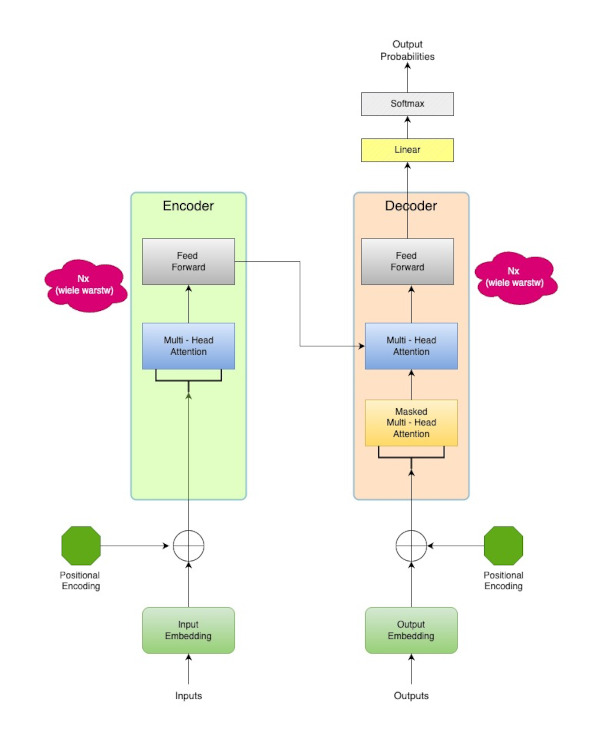

# LLM - uczenie - AI Engineering

## Fazy przetwarzania modelu

### Wstępny trening modelu LLM ( Pre-Training)

#### Stan początkowy - niewytrenowany model

Przed wytrenowaniem model LLM to pusta sieć neuronowa. Jej parametry ( wagi połączeń pomiędzy neuronami ) są
zainicjowane losowymi wartościami.

Nie posiada wiedzy o języku, strukturze, gramatyce, nie zna żadnych słów.
Zadanie jakiegokolwiek pytania do takiego modelu skutkowałoby wygenerowaniem wielu losowych znaków.

```
+--------------------------+
|  Wejście (Tokeny/Embedingi) |
+--------------------------+
             |             
             |  (Chaos Losowych Połączeń)
             V             
+--------------------------+
|       Warstwa 1          |
|    (Puste Wagi/Brak Wzorców) |
+--------------------------+
             |             
             |  (Szum, Brak Organizacji)
             V             
+--------------------------+
|       Warstwa 2          |
|    (Brak Semantycznego Zrozumienia) |
+--------------------------+
             |             
             |  (...)      
             V             
+--------------------------+
|       Warstwa N          |
|    (Brak Wyuczonych Relacji) |
+--------------------------+
             |             
             |             
             V             
+--------------------------+
| Wyjście (Losowe Przewidywania) |
+--------------------------+
```
#### Architektura LLM - Transformer

W kontekście LLM, Transformer jest architekturą, która pozwala modelowi przetwarzać i rozumieć sekwencje danych (takich jak tekst) w sposób wysoce równoległy i efektywny, uchwytując złożone zależności kontekstowe. Zasadniczo, jest to "silnik", który pobiera numeryczne reprezentacje słów i przekształca je w reprezentacje, z których można generować nowy tekst lub odpowiadać na pytania.

Został on opisany w dokumencie [Attention Is All You Need](https://arxiv.org/pdf/1706.03762) , oraz [Czym jest i jak
działa Transformer (sieć neuronowa)](https://miroslawmamczur.pl/czym-jest-i-jak-dziala-transformer-siec-neuronowa/

Diagram architektury transformera wygląda następująco:



##### Słownik tokenów i macierz Input Embeddings

Zanim rozpocznie się faktyczny proces uczenia, konieczne jest przygotowanie dwóch powiązanych ze sobą struktur 
pomocniczych - **Słownika tokenów** oraz macierzy **Input 
Embedding**. Jej powstanie musi zostać zostać poprzedzone 
stworzeniem jeszcze bardziej pierwotnej struktury - słownika tokenów. 

**Słownik tokenów** - jest to struktura której zadaniem jest przetworzenie tekstu na format zrozumiały dla przetwarzania numerycznego.  

W procesie tokenizacji każde zdanie ze zbioru uczącego przetwarzane jest na jednostki:

Jako przykład niech posłuży zdanie: "Natura stwarza najpiękniejsze obrazy"
    
  * "Natura"
  * "stwarza"
  * "najpiękniejsze"
  * "obrazy"

Następnie każdy token otrzymuje unikalny identyfikator liczbowy. Identyfikatory są stałe podczas całego procesu uczenia.

  * "Natura" (ID: 201)
  * "stwarza" (ID: 315)
  * "najpiękniejsze" (ID: 489)
  * "obrazy" (ID: 522)

W tym kroku model uczy się swojego słownika tokenów. Oznacza to, że zostają zidentyfikowane wszystkie unikalne słowa 
i pod-słowa, które będzie rozpoznawał.

Pierwszą warstwą architektury transformera jest **macierz Input Embeddings** powstająca bezpośrednio po kroku tworzenia 
słownika tokenów. Jest to specjalna numeryczna reprezentacja słownika. Posiada tyle wierszy, 
   ile jest  
   elementów w słowniku. Do każdego tokena przypisany jest wektor liczb stałoprzecinkowych. Inicjalnie posiada on 
   losowe wartości, które będą aktywnie optymalizowane podczas całego procesu uczenia. Są one parametrami 
   modelu. Dzięki nim model uczy się znaczenia słów. Liczba kolumn wektora embeddingu jest hyperparametrem 
   przypisanym do modelu.  Często jest to 768, ale mogą to być inne wartości, np. 1024.

| Token            | ID  | Embedding (4 liczby)       |
|------------------|-----|----------------------------|
| "Natura"         | 201 | [0.12, -0.87, 0.45, 0.33]  |
| "stwarza"        | 315 | [-0.56, 0.91, -0.22, 0.77] |
| "najpiękniejsze" | 489 | [0.03, 0.65, -0.44, -0.19] |
| "obrazy"         | 522 | [0.88, -0.11, 0.29, -0.73] |


##### Tablica Positional Embeddings

Przed rozpoczęciem treningu konieczne jest stworzenie globalnej ** tablicy positional embeddings ** . Jest globalnym 
zbiorem wektorów dla wszystkich możliwych pozycji jakie model może napotkać. Tablica ta ma tyle wierszy ile tokenów 
może mieć największa sekwencja przetwarzana przez ten model (a więc np. 512, 1024, 2048, ... , itd...). Dla każdej 
pozycji przechowywany jest wektor embedding , o długości zgodnej z długością embeddingów określonych w parametrach 
modelu(np. 768, 1024). Wektory input i positional mają te same wymiary,co pozawla na ich wzajemne sumowanie. 

Przy założeniu że nasz model może przetwarzać sekwencje o maksymalnej długości 8 tokenów i określono dla 
niego _wymiar_embeddingu = 4_ , to inicjalna tablica embeddingów pozycyjnych mogłaby wyglądać następująco:

| Pozycja | Wektor Embeddingu Pozycyjnego (PE) - Wymiar 4   |
|---------|-----------------------------------------------|
| 0       | [0.01, 0.02, 0.03, 0.04]                      |
| 1       | [0.05, 0.06, 0.07, 0.08]                      |
| 2       | [0.09, 0.10, 0.11, 0.12]                      |
| 3       | [0.13, 0.14, 0.15, 0.16]                      |
| 4       | [0.17, 0.18, 0.19, 0.20]                      |
| 5       | [0.21, 0.22, 0.23, 0.24]                      |
| 6       | [0.25, 0.26, 0.27, 0.28]                      |
| 7       | [0.29, 0.30, 0.31, 0.32]                      |
| ...     | ... (aż do max\_seq\_length - 1)               |

Zatem posługując się identyfikatorem pozycji tokenu jak łącznikiem możemy skojarzyć ze sobą element z tablicy 
**Input Embeddings** z elementem z tablicy **Positional Embeddings** . 

| Pozycja | Token            | Wektor Kodowania Pozycyjnego (PE) - Wymiar 4   |
|---------|------------------|-----------------------------------------------|
| 0       | "Natura"         | [0.01, 0.02, 0.03, 0.04]                      |
| 1       | "stwarza"        | [0.05, 0.06, 0.07, 0.08]                      |
| 2       | "najpiękniejsze" | [0.09, 0.10, 0.11, 0.12]                      |
| 3       | "obrazy"         | [0.13, 0.14, 0.15, 0.16]                      |

Dla każdego elementu mamy do dyspozycji dwa wektory embeddings, po jednym z każdej tabeli. 

Teraz dla każdego tokenu dokonujemy sumowania embeddingów i w ten sposób powstanie Finalny Input Embedding, który ma 
zakodowaną informację zarówno o znaczeniu semantycznym tokenu, jak i jego pozycji w sekwencji. Finalny Input 
Embedding jest to struktura która będzie wykorzystywana w dalszym procesie uczenia. 

| Pozycja | Token            | ID  | Input Embedding (4 liczby)      | Wektor Kodowania Pozycyjnego (PE) - Wymiar 4 | Finalny Input Embedding (Sumowany)   |
|---------|------------------|-----|----------------------------------|----------------------------------------------|--------------------------------------|
| 0       | "Natura"         | 201 | [0.12, -0.87, 0.45, 0.33]       | [0.01, 0.02, 0.03, 0.04]                     | [0.13, -0.85, 0.48, 0.37]            |
| 1       | "stwarza"        | 315 | [-0.56, 0.91, -0.22, 0.77]      | [0.05, 0.06, 0.07, 0.08]                     | [-0.51, 0.97, -0.15, 0.85]           |
| 2       | "najpiękniejsze" | 489 | [0.03, 0.65, -0.44, -0.19]      | [0.09, 0.10, 0.11, 0.12]                     | [0.12, 0.75, -0.33, -0.07]           |
| 3       | "obrazy"         | 522 | [0.88, -0.11, 0.29, -0.73]      | [0.13, 0.14, 0.15, 0.16]                     | [1.01, 0.03, 0.44, -0.57]            |

Wektor wynikowy jest unikalny dla konkretnego słowa na konkretnej pozycji. Dalsze warstwy transformera, a zwłaszcza 
mechanizm uwagi są sieciami neuronowymi, które podczas treningu uczą się jak interpretować te wzbogacone wektory. 

Finalny wektor **Input Embedding** jest skonstruowany w taki sposób, aby słowa o podobnym znaczeniu miały podobne 
wektory (czyli znalazły się blisko siebie w przestrzeni wielowymiarowej). Wymiar tej przestrzeni jest ograniczony 
wymiarem wektora **Input Embedding**. Jeśli ma on długość 768 to znaczy że każde słowo, lub token reprezentowane 
jest jako punkt w 768 wymiarowej przestrzeni wektorowej.
 
Dla lepszego zrozumienia można posłużyć się analogią do smaku potrawy: 

Składa się z wielu składników, które są ze sobą wymieszane. Nie "rozdzielasz" ich w ustach, ale twój mózg uczy się rozpoznawać poszczególne smaki i ich kombinacje. Podobnie Transformer uczy się, że pewne kombinacje wartości w wektorze (które wynikają z sumy V_słowo i PE) sygnalizują, że "to jest rzeczownik na początku zdania", a inne kombinacje, że "to jest czasownik w środku zdania".

##### Sposób działania Encodera

Jest to ta część architektury Transformera która odpowiada za uczenie modelu. Składa się on z kilku 
dwuelementowych bloków (warstw). Zwykle jest ich kilka - od 6 do 12.
Każda taka warstwa przetwarza dane i przekazuje je do następnej, stopniowo budując coraz bardziej złożone i abstrakcyjne rozumienie wejściowej sekwencji.


###### Jak działa pojedyncza Warstwa Enkodera?
Pojedyncza warstwa encodera składa się z dwóch wyspecjalizowanych podbloków

* Multi-Head Self-Attention (Wielogłowicowa Self-Attention)
* Feed-Forward Network (Sieć Przewijająca do Przodu)

**Multi-Head Self-Attention**

Głowica uwagi ( **Attention Head** ) to kluczowy komponent architektury **Transformer**. Jest to filtr, lub 
perspektywa, która jest wykorzystywania do analizowania relacji pomiędzy tokenami w sekwencji. Wiele ( **Attention 
Head** ) składa się na mechanizm (**Multi Head**)). Dzięki temu, że każda z głowic , w procesie uczenia  
specjalizuje się w jakimś specjalnym aspekcie powiązań pomiędzy tokenami.  

Z każdą głowicą związane są trzy unikalne dla niej macierze Wag, które podlegają procesowi uczenia. Są to macierze 
(Wq, Wk, Wv). Na początku uczenia są one inicjalizowane losowymi wartościami, które będą podlegać modyfikacjom (na 
tym polega ta specjalizacja). Macierze wag są unikalne dla każdej głowicy, ale są one takie same dla wszystkich 
tokenów przetwarzanych przez tę głowicę. 

Proces przetwarzania dla każdej głowicy odbywa się według stałej sekwencji:

1. Każda głowica otrzymuje wektory **Final Input Embeddings** dla wszystkich tokenów składających się na
   przetwarzaną sekwencję.
2. Głowica, dla każdego tokena w sekwencji wykonuje mnożenie własnych macierzy wag **(Wq,Wk,Wv)** z każdym z wektorem  
**Final Input Encodings** dla każdego z tokenów, w ten sposób powstają trzy wektory pomocnicze Q(Query), K(Key),
   Value(V) dla każdego tokena w sekwencji
3. **Mechanizm uwagi** 
   * Macierz **Q** aktualnie przetwarzanego tokenu jest porównywany z wektorek **K** każdego 
      tokenu w sekwencji. Daje to odpowiedź na pytanie jak istotny jest każdy inny token w sekwencji dla zrozumienia 
      sensu aktualnie przetwarzanego tokena. Jeśli K innego tokena pasuje do Q bieżącego tokenta to znaczy że on jest 
      "ważny". W tym kroku obliczane są **współczynniki uwagi**.
   * Na podstawie tych porównań oraz współczynników uwagi generowana jest ważona suma **V** wszystkich tokenów 
     wchodzących w skład sekwencji. Powstają więc wektory **V1,V2,V3,...,Vn**. Jest to wynik pracy głowicy. Jest to nowa, bardziej 
     kontekstualizowana reprezentacja dla przetwarzanego tokena.
4. Wyniki ze wszystkich głowic dla danego tokena są konkatenowane, tworzony jest jeden bardzo długi wektor, który 
   zawiera wartości liczbowe zawierające syntezę wszysktich różnych perspektyw z poszczególnych głowic.
5. Następnie ten długi wektor przepuszczany jest przez finalną, nauczalną macierz wag **W0 (Output Projection)**. 
   Macierz **W0 (Output Projection)** jest trenowana aby jak najlepiej łączyć projekcje. Macierz a jest parametrem 
   modelu używanym w komponencie **Multi-Head Attention** do finalnego ukształtowania jego wyjścia (nie jest 
   natomiast samym wyjściem)
6. Obliczane jest wyjście z komponentu **Multi-Head Attention**. Jest to wynik mnożenia macierzy **V** przez macierz 
   **W0**. 
   
Macierz wyjściowa z komponentu **Multi-Head Attention** poddawana jest dalszemu przetwarzaniu przez komponent ("Add 
& Norm") i normalizacji.

Trafia do kolejnego komponentu w obrębie Encodera - **Feed-Forward-Network**.

**Feed-Forward-Network**


